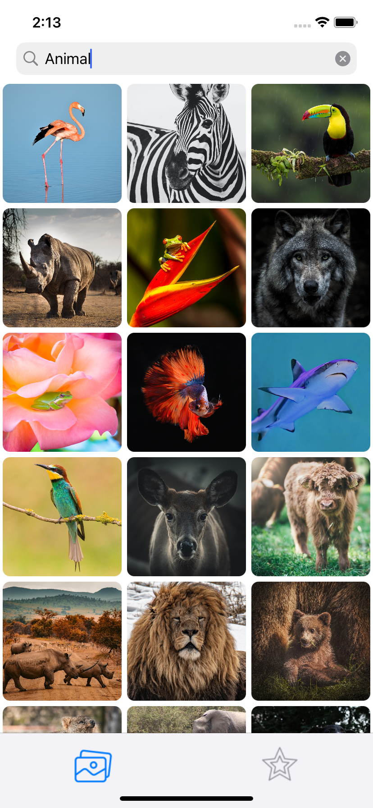
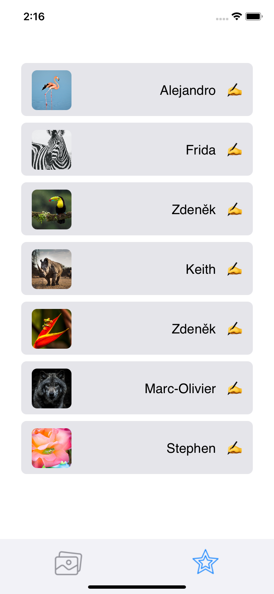
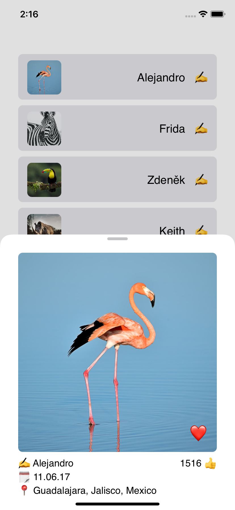
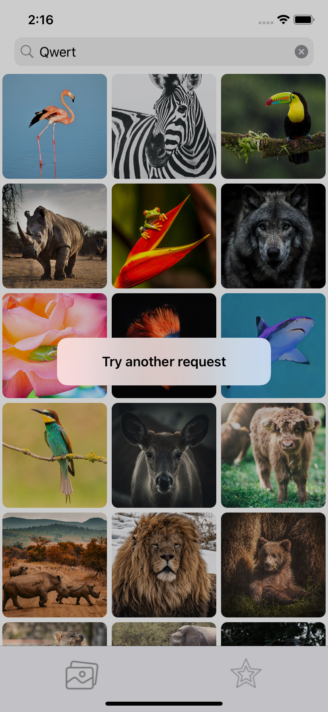

## Описание приложения

Приложение создаёт галерею фотографий с сайта Unsplash.com

Стартовый экран - таббар с двумя экранами.

Первый (галлерея) - строка поиска и коллекция фотографий.

Второй (избранное) - таблица со списком избранных фотографий.

При нажатии на ячейку открывается экран дополнительной информации, содержащий:
- фотографию с кнопкой добавления в избранное
- имя автора
- дату публикации
- местоположение
- количество лайков

При неправильном запросе в строке поиска появляется алерт.

   

## Установка библиотек

В приложении используется библиотека BouncyLayout (анимация коллекции), для установки необходимо использовать команду pod install.

Минимальая версия iOS 15.2
